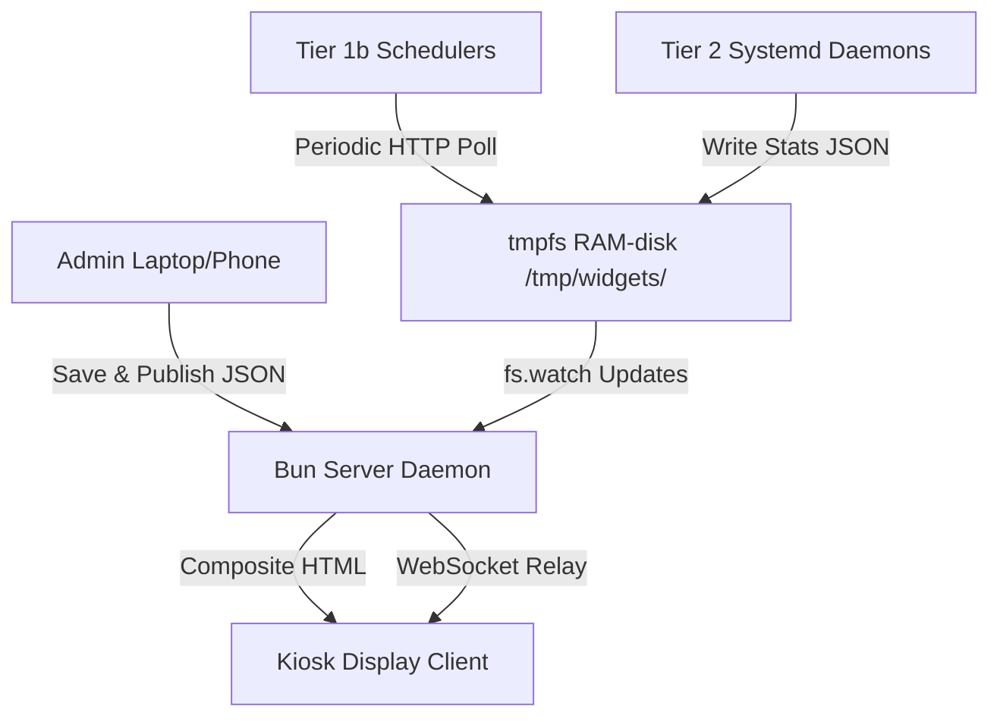

# PiDashboard Documentation Hub

Welcome to the **PiDashboard** documentation. This suite provides comprehensive, modular guides for deploying, using, extending, and understanding the PiDashboard system on low-resource hardware like the Raspberry Pi Zero 2W.

---

## 🗺️ Documentation Directory

To get started with specific aspects of the project, follow these modular guides:

1. [**Pi Installation & Deployment Guide**](file:///f:/VSCodium/Github/PiDashboard/core/docs/pi-installation.md)
   *Step-by-step setup for Pi hardware, tmpfs memory disk, autostart services, and kiosk web client.*
2. [**User Guide & Operations**](file:///f:/VSCodium/Github/PiDashboard/core/docs/user-guide.md)
   *Learn how to operate the Web Admin Panel, drag-and-drop layout scaling, templates, and one-click Maintenance Mode.*
3. [**Widget Development Guide**](file:///f:/VSCodium/Github/PiDashboard/core/docs/widget-development.md)
   *Learn how to package custom HTML snippet fragments and configure JSON manifests for automatic dynamic form generation.*
4. [**Daemon Development Guide (Tier 2)**](file:///f:/VSCodium/Github/PiDashboard/core/docs/daemon-development.md)
   *Develop low-level background systemd daemons that write structured JSON updates directly to RAM-disk pipelines.*
5. [**Codebase Architecture & Decisions**](file:///f:/VSCodium/Github/PiDashboard/core/docs/codebase-explanation.md)
   *Deep-dive into core code layers (Bun, React, WebSocket) explaining design decisions and runtime memory advantages.*

---

## 🏗️ Architectural Overview

PiDashboard is structured around a **Decoupled Client-Side Editing** and **Zero-Framework Composed Kiosk Rendering** model. The Pi does zero processing during editing sessions; layout rendering and calculations are completely offloaded to the client's web browser, keeping Pi CPU overhead at 0%.

### Key Advantages of this Architecture
- **Low Memory Footprint:** The kiosk browser loads a raw, lightweight composed HTML page with a tiny WebSocket script (~5KB JS runtime total), bringing long-term RSS RAM allocation down to ~172MB.
- **Single Process Host:** By unifying the web server, WebSocket relay, and scheduled API fetcher into a single Bun process, baseline context-switching costs are eliminated.
- **Zero-Latency IPC:** By utilizing `/tmp/widgets/` in RAM-disk tmpfs, background hardware monitors write state values at zero disk write cost and zero database latency, keeping storage wear on SD cards to absolute zero.
